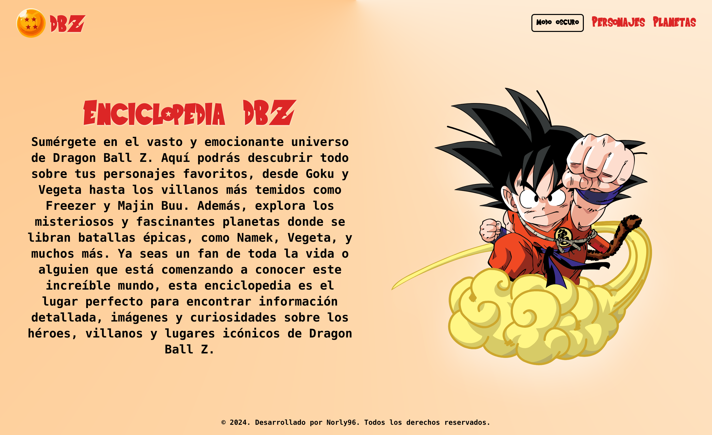
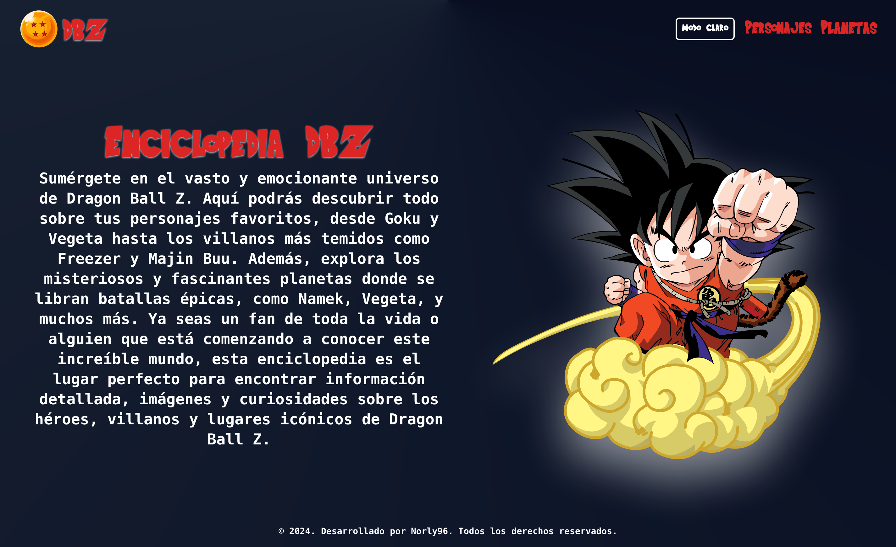
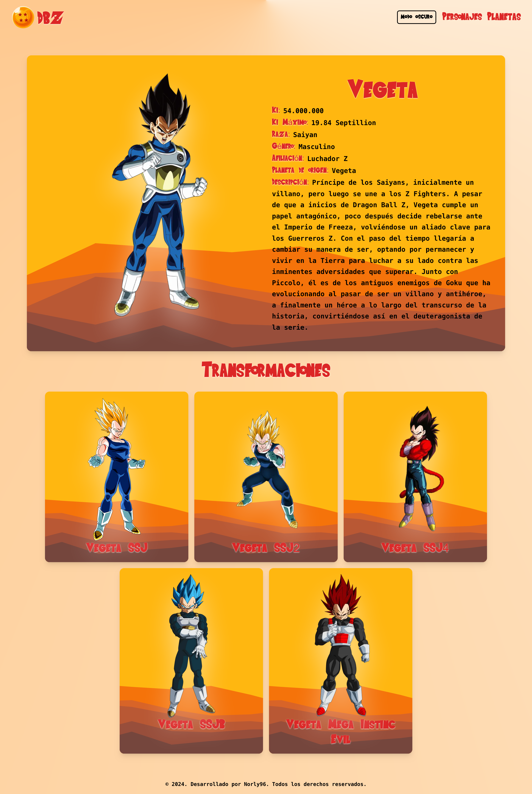

# DBZ Next.js

Este proyecto es una aplicación web desarrollada con Next.js que consume la API de Dragon Ball. Permite explorar personajes y planetas del universo Dragon Ball, utilizando técnicas de renderizado del lado del servidor y generación de rutas estáticas.

## Características

- **Lista de personajes:** Visualiza los personajes de Dragon Ball Z.
- **Lista de planetas:** Explora los distintos planetas del universo.

### Captura de Pantallas








### Enlaces

Deploy by Vercel

- Site URL: [DBZ-NextJs](https://dbz-nextjs.vercel.app/)

## Instalación

1. Clona el repositorio:

   ```bash
   git clone https://github.com/norly96/dbz-nextjs.git

   ```

2. Navega al directorio del proyecto:

```bash
cd dbz-nextjs
```

3. Instala las dependencias:

```bash
npm install
```

5. Inicia el servidor

```bash
npm run dev
```

## Tecnologías utilizadas

1. HTML, CSS, TypeScript, [NextJS](https://nextjs.org/), [TailwindCSS](https://tailwindcss.com/)

2. API: [Dragon Ball API](https://web.dragonball-api.com/documentation)

## Contacto

Nombre: Norluis Galvez Sanchez
Website: [Norly96](https://norly96.com)

GitHub: [Norly96](https://github.com/norly96)

Linkedin: [Norly96](https://www.linkedin.com/in/norly96)
